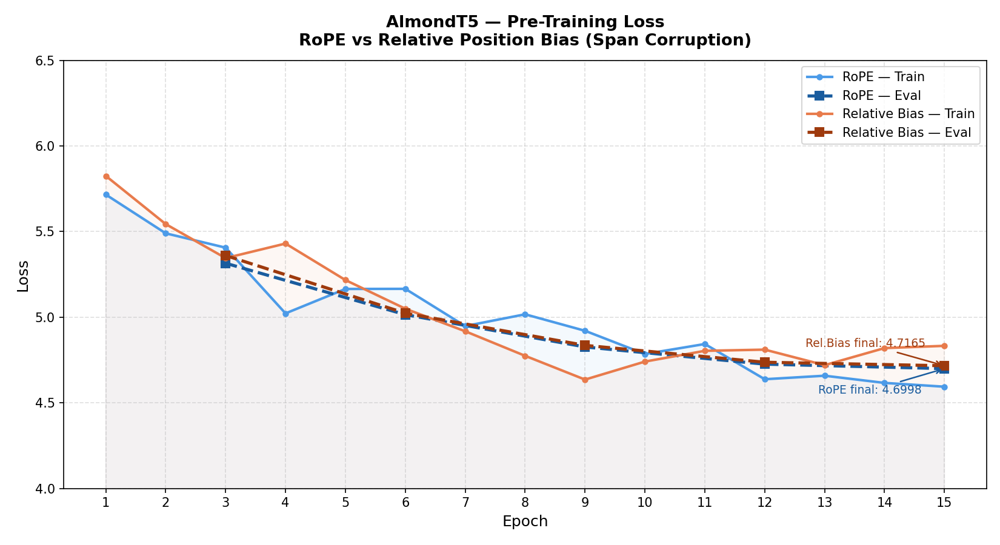
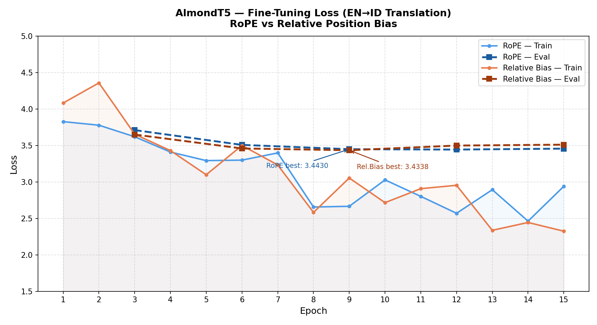
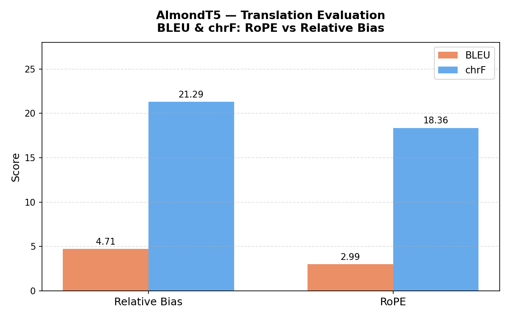

# AlmondT5 — End-to-End T5 Text-to-Text from Scratch

> *Small like an almond. Built to understand the bridge between reading and generating.*

AlmondT5 is a small T5-style encoder-decoder model built from scratch to understand the full lifecycle of sequence-to-sequence learning: SentencePiece tokenizer, span corruption pre-training, and supervised translation fine-tuning — with an ablation study comparing two positional encoding strategies.

**This is not a fine-tuned version of an existing T5 model.** Every component is implemented manually: Unigram SentencePiece tokenizer, encoder-only and decoder-only Transformer blocks with modern design choices, span corruption objective, and EN→ID translation fine-tuning.

---

## How T5 Differs from GPT and BERT

```
GPT  (Decoder-only)  → reads partial context, generates next token
BERT (Encoder-only)  → reads full sentence bidirectionally, produces representations
T5   (Encoder-Decoder) → encoder reads and understands the full input,
                          decoder uses that understanding to generate output
```

T5 combines both worlds: the encoder behaves like BERT (bidirectional, full context understanding), and the decoder behaves like GPT (autoregressive generation). The bridge between them is **cross-attention** — at every decoder step, the decoder queries the encoder's output to decide which parts of the input are relevant for the next token being generated.

Every task in T5 is framed as **text-to-text**:

```
Translation   : "translate English to Indonesian: Hello"  →  "Halo"
Summarization : "summarize: The article says..."          →  "Short summary"
Classification: "sentiment: This movie is great"          →  "positive"
```

One model, one objective, all tasks.

---

## Pipeline Overview

```
Wikipedia EN + ID (raw text)
          ↓
SentencePiece Unigram Tokenizer (from scratch)
          ↓
Pre-Training — Span Corruption (AlmondT5 Base)
          ↓
Fine-Tuning — EN→ID Translation
          ↓
Ablation: RoPE vs Relative Position Bias
```

---

## Architecture

| Component | Vanilla T5 | AlmondT5 | Why |
|-----------|-----------|----------|-----|
| Positional Encoding | Relative Bias | **RoPE + Relative Bias** (ablation) | Compare both strategies |
| Normalization | Pre-LN RMSNorm | Pre-LN RMSNorm ✅ | Same, training stability |
| Encoder FFN | ReLU | GeGLU | Better gated non-linearity |
| Decoder FFN | ReLU | SwiGLU | Better gated non-linearity |
| Encoder Attention | Full MHA | Alternating + Unpadding | Compute efficiency |
| Decoder Attention | Full MHA | MHA + KV Cache | Efficient autoregressive inference |
| Cross-Attention | Standard | Standard + KV Cache | Avoid encoder recompute |
| Tokenizer | SentencePiece Unigram | SentencePiece Unigram ✅ | Faithful to T5 original |
| Tied Embeddings | ✅ | ✅ | Share encoder/decoder/lm_head weights |

**Model size:** ~15-20M parameters
**Vocab size:** 6,000 (SentencePiece Unigram)
**Context length:** encoder 128, decoder 128

---

## Ablation — RoPE vs Relative Position Bias

AlmondT5 was trained twice with identical configs except positional encoding:

| | Relative Bias | RoPE |
|--|--------------|------|
| Pre-train final eval loss | **4.7165** | 4.6998 |
| Fine-tune best eval loss | **3.4338** | 3.4430 |
| BLEU (500 samples) | **4.7118** | 2.9945 |
| chrF (500 samples) | **21.2895** | 18.3580 |

**Relative Bias wins on BLEU and chrF despite similar loss.**

This is a key finding: loss alone does not predict downstream quality. Relative Bias encodes token distances as discrete buckets with logarithmic scaling — this is more naturally aligned with how translation models need to handle position (nearby tokens matter most, distant tokens matter less but shouldn't be ignored). RoPE's continuous rotation-based encoding, while excellent for language modeling, may not carry the same inductive bias for seq2seq tasks at small scale.

---

## Training Summary

### Pre-Training (Span Corruption)

- **Dataset:** Wikipedia EN + ID (25,000 rows each)
- **Tokenizer:** SentencePiece Unigram, vocab 6,000, bilingual corpus
- **Objective:** Span Corruption — 15% tokens masked, mean span length 3
- **Optimizer:** AdamW, LR 3e-4, weight decay 0.01
- **Epochs:** 15 (eval every 3)



| Epoch | Rel.Bias Train | Rel.Bias Eval | RoPE Train | RoPE Eval |
|-------|---------------|--------------|-----------|----------|
| 3 | 5.3452 | 5.3604 | 5.4062 | 5.3152 |
| 6 | 5.0496 | 5.0235 | 5.1657 | 5.0150 |
| 9 | 4.6357 | 4.8356 | 4.9207 | 4.8264 |
| 12 | 4.8107 | 4.7370 | 4.6378 | 4.7259 |
| 15 | 4.8328 | **4.7165** | 4.5941 | **4.6998** |

### Fine-Tuning (EN→ID Translation)

- **Dataset:** OPUS Indonesian-English (25,000 pairs)
- **Prefix:** `"translate English to Indonesian: "`
- **Optimizer:** AdamW, LR 1e-4
- **Epochs:** 15 (eval every 3)



| Epoch | Rel.Bias Train | Rel.Bias Eval | RoPE Train | RoPE Eval |
|-------|---------------|--------------|-----------|----------|
| 3 | 3.6536 | 3.6486 | 3.6185 | 3.7097 |
| 6 | 3.4994 | 3.4581 | 3.2982 | 3.5070 |
| 9 | 3.0532 | **3.4338** | 2.6651 | **3.4480** |
| 12 | 2.9532 | 3.4978 | 2.5692 | **3.4430** |
| 15 | 2.3236 | 3.5100 | 2.9392 | 3.4557 |

---

## Evaluation Results



```
                  Relative Bias    RoPE
BLEU            :    4.7118        2.9945
chrF            :   21.2895       18.3580
```

### Sample Predictions

```
EN  : I said I wouldn't do it.
REF : Aku bilang kalau aku tidak mau melakukannya.
BIAS: Kurasa aku tidak bisa melakukan akukan aku.
ROPE: Aku tidak akan membiarkannya.

EN  : What?
REF : Apa?
BIAS: Apa?        ← correct ✓
ROPE: Apa?        ← correct ✓

EN  : No, you go ahead.
REF : Tidak, kamu duluan saja.
BIAS: Tidak, jangan bukan apa.
ROPE: Tidak, tidak.
```

---

## Limitations

- **Small vocab (6,000)** — SentencePiece fragments many Indonesian words. Low BLEU is expected at this vocab size. Standard T5 uses 32,000.
- **Small model (~15-20M)** — T5-small has 60M parameters. Insufficient capacity for high-quality translation.
- **Small dataset (25k pairs)** — competitive EN-ID models train on millions of parallel sentences.
- **Shallow network (6 encoder + 6 decoder blocks)** — insufficient depth for complex cross-lingual mapping.
- **Span corruption output** — model correctly identifies span positions but fills them with plausible tokens rather than exact originals. Expected at small scale.

**What this project proves:** the full T5 pipeline works end-to-end — span corruption pre-training, teacher forcing fine-tuning, and ablation between positional encoding strategies. Every component is implemented from scratch and functionally correct.

---

## Project Structure

```
end-to-end-t5-text-to-text/
├── pyproject.toml
├── README.md
├── configs/
│   └── config.yaml
├── tokenizer/
│   ├── sp.py               # SentencePiece wrapper
│   └── train.py            # Tokenizer training
├── data/
│   ├── pretrain/
│   │   ├── raw/            # Wikipedia EN + ID corpus
│   │   └── processed/      # Span-corrupted .jsonl
│   └── finetune/
│       ├── raw/            # OPUS EN-ID bilingual pairs
│       └── processed/
├── basemodel/
│   ├── model/              # Encoder, Decoder, T5, Block, Attention, GeGLU, SwiGLU, RoPE, RelBias
│   └── training/           # Pre-training loop (span corruption)
├── finetune/
│   ├── model/              # T5ForTranslation head
│   └── training/           # Fine-tuning loop + eval
├── eval/
│   └── translation_eval.py # BLEU + chrF evaluation
├── models/
│   ├── tokenizer/
│   ├── pretrain/
│   └── finetune/
├── docs/
│   ├── pretrain.md
│   ├── finetune.md
│   └── assets/
│       ├── pretrain_loss.png
│       ├── finetune_loss.png
│       └── eval_scores.png
└── plot_losses.py
```

---

## Setup

```bash
git clone https://github.com/adinfarel/end-to-end-t5-text-to-text.git
cd end-to-end-t5-text-to-text
pip install -e .
pip install -e ".[dev]"
```

### Run Full Pipeline

```bash
# 1. Train SentencePiece tokenizer
make train-tokenizer

# 2. Pre-train with span corruption
make pretrain

# 3. Fine-tune EN→ID translation
make finetune

# 4. Evaluate (BLEU + chrF)
make eval-finetune

# 5. Generate loss plots
python plot_losses.py
```

---

## What I Learned

**T5 is GPT and BERT working together.**

The encoder reads and understands — bidirectionally, without causal constraints, building a rich contextual representation of the input. The decoder generates — autoregressively, one token at a time, using cross-attention to pull relevant information from the encoder at every step. Neither could do the other's job alone.

**Span corruption is harder than MLM.**

In BERT MLM, predicting a masked token has a single well-defined answer. In span corruption, the decoder must predict: the right sentinel token, then the right tokens in the right order, then the next sentinel, and so on — while attending to a corrupted encoder input. The decoder has to reconstruct not just content but structure. This is why pre-training loss stays higher than BERT despite equivalent model size.

**Loss does not predict BLEU.**

Relative Bias and RoPE converged to nearly identical pre-training and fine-tuning losses (4.71 vs 4.70, 3.43 vs 3.44). Yet Relative Bias scored 4.71 BLEU vs 2.99 for RoPE — a 57% difference. This shows that how a model encodes position affects the quality of generation in ways that cross-entropy loss on training data cannot capture.

**Small vocab is the primary bottleneck.**

With only 6,000 SentencePiece tokens covering both English and Indonesian, many words fragment into 3-5 subword pieces. The decoder has to generate each fragment in the right order — compounding errors at every step. This single factor explains most of the output quality issues more than model size or training duration.

**Tied embeddings as parameter efficiency.**

Sharing weights between the encoder embedding, decoder embedding, and LM head reduces parameter count significantly while maintaining quality. The model learns one unified token representation used everywhere — an elegant design choice that T5 borrowed from earlier seq2seq work.

---

*Built by Adinfarel — AI Engineering track*
*"The goal was never to build something impressive. The goal was to understand."*
